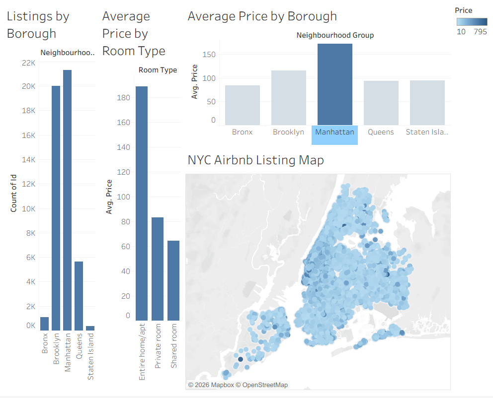
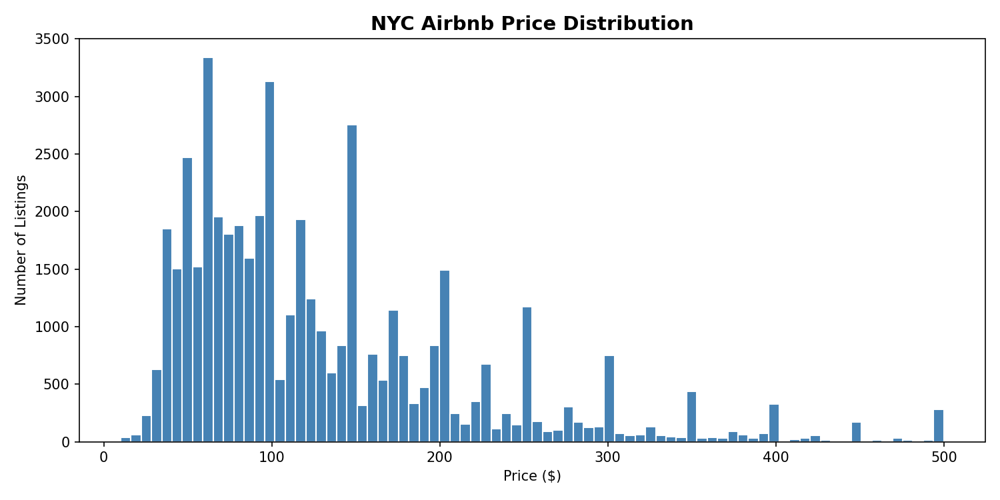
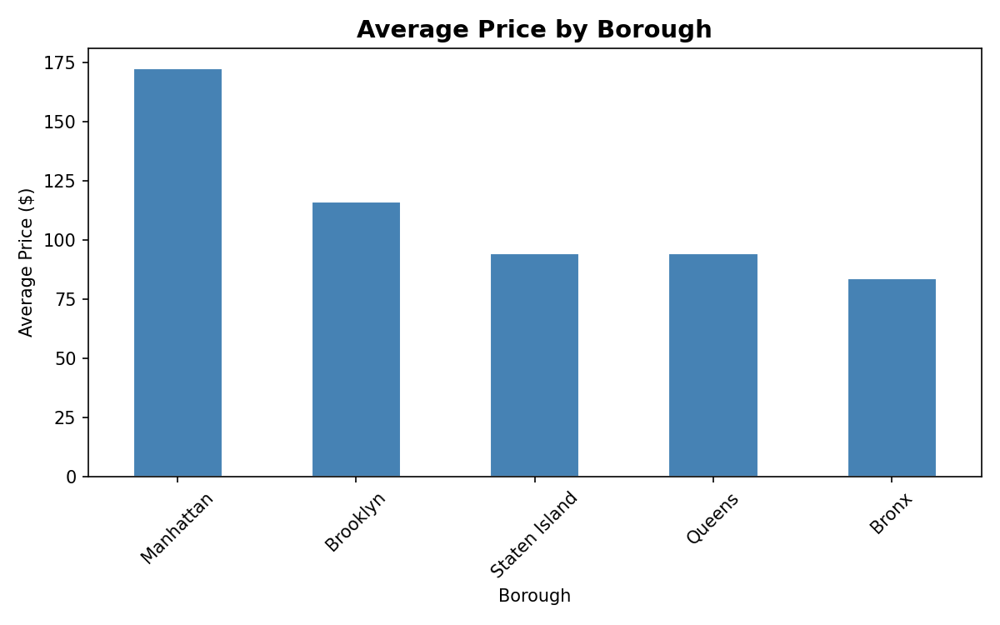
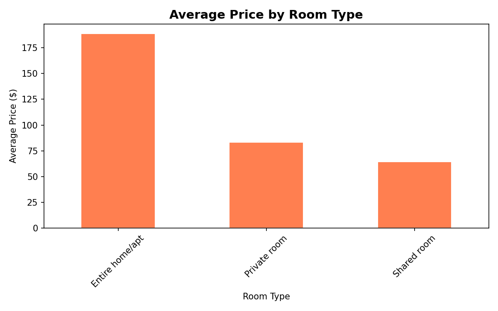
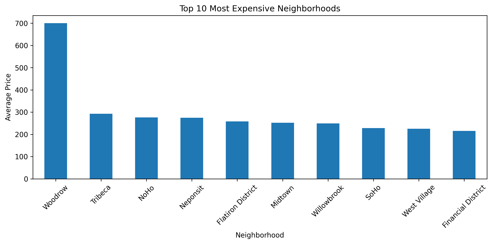
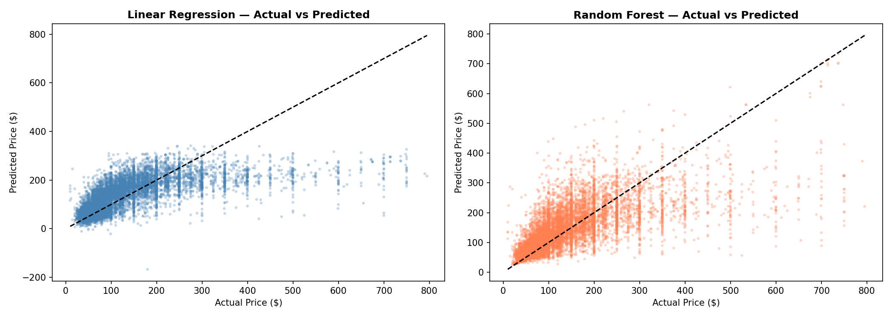

# Airbnb Price Prediction & Neighborhood Analysis — NYC



## Overview

This project analyzes **48,392 Airbnb listings in New York City** and builds machine learning models to predict listing prices using location, room type, availability, and review-related features. It also includes a Tableau dashboard to visualize borough-level and neighborhood-level pricing trends.

## Business Problem

Airbnb hosts need to set competitive prices. Pricing too high may reduce bookings, while pricing too low can reduce revenue. This project helps identify pricing patterns and potentially underpriced listings.

## Dataset

**Dataset:** New York City Airbnb Open Data
**File used:** `AB_NYC_2019.csv`

The dataset includes listing information such as borough, neighborhood, room type, price, reviews, availability, latitude, and longitude.

## Tools Used

* Python
* Pandas
* NumPy
* Matplotlib
* Scikit-learn
* Tableau
* GitHub

## Project Structure

```text
data/
  raw/
    AB_NYC_2019.csv

  processed/
    airbnb_cleaned.csv
    tableau_airbnb_dashboard_data.csv
    tableau_neighborhood_summary.csv

notebooks/
  01_data_cleaning.ipynb
  02_exploratory_data_analysis.ipynb
  03_modeling.ipynb
  04_dashboard_export.ipynb

dashboard/
  airbnb_dashboard.twb

images/
  dashboard_screenshot.png
  price_by_neighborhood.png
  price_distribution.png
  avg_price_by_borough.png
  avg_price_by_roomtype.png
  actual_vs_predicted.png

README.md
```

## Data Cleaning

In `01_data_cleaning.ipynb`, the raw dataset was cleaned and prepared for analysis.

Main steps:

* Selected useful columns
* Filled missing values
* Removed listings with price equal to 0
* Removed extreme price outliers above the 99th percentile
* Created new features:

  * `is_private_room`
  * `is_entire_home`
  * `has_reviews`
  * `price_per_review`

Final cleaned dataset:

```text
48,392 rows × 20 columns
```

## Exploratory Data Analysis

In `02_exploratory_data_analysis.ipynb`, the project explored pricing patterns across NYC.

### Price Distribution



### Average Price by Borough



### Average Price by Room Type



### Top 10 Expensive Neighborhoods



Key findings:

* Entire homes are the most expensive room type.
* Manhattan has the highest average Airbnb price.
* Brooklyn has a high number of listings and more affordable average prices than Manhattan.
* Price distribution is right-skewed, meaning most listings are affordable or mid-range, while a smaller number of luxury listings raise the average price.

## Dashboard Preview

The Tableau dashboard includes:

* Listings by borough
* Average price by room type
* Average price by borough
* NYC Airbnb listing map


## Machine Learning

In `03_modeling.ipynb`, machine learning models were trained to predict Airbnb prices.

Models used:

* Linear Regression
* Random Forest Regressor

Evaluation metrics:

* Mean Absolute Error
* R² Score

Best model:

```text
Random Forest
MAE: $47.08
R² Score: 0.46
```

### Actual vs Predicted Prices



The model was also used to identify potentially underpriced listings by comparing actual prices with predicted prices.

## Key Business Insights

* Location is one of the strongest pricing factors.
* Entire homes cost significantly more than private or shared rooms.
* Manhattan listings have a strong price premium.
* Brooklyn is a strong high-volume market with more competitive prices.
* Machine learning can help estimate fair market pricing and flag underpriced listings.

## How to Run

1. Clone the repository:

```bash
git clone https://github.com/yourusername/airbnb-price-prediction-neighborhood-analysis.git
cd airbnb-price-prediction-neighborhood-analysis
```

2. Install dependencies:

```bash
pip install pandas numpy matplotlib scikit-learn jupyter
```

3. Download `AB_NYC_2019.csv` and place it in:

```text
data/raw/
```

4. Run notebooks in order:

```text
01_data_cleaning.ipynb
02_exploratory_data_analysis.ipynb
03_modeling.ipynb
04_dashboard_export.ipynb
```

5. Open the Tableau dashboard from:

```text
dashboard/airbnb_dashboard.twb
```

## Author

**Syeda Saniya Muskan**
GitHub: `https://github.com/syedas2650`
LinkedIn: `https://www.linkedin.com/in/saniya-muskan-syeda-032b44309/`

**Mohamed Fayaz Buhari**
GitHub: `https://github.com/FAYAZBUHARI`
LinkedIn: `https://www.linkedin.com/in/mohamedfayazbuhari/`

## License

This project is open source under the MIT License.
